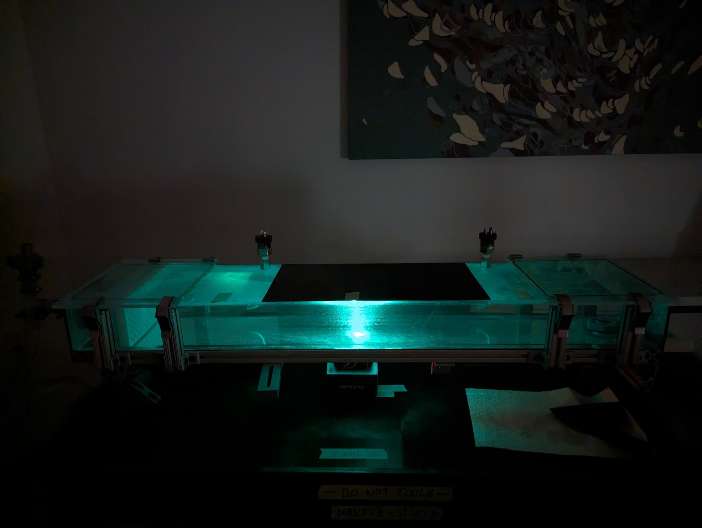
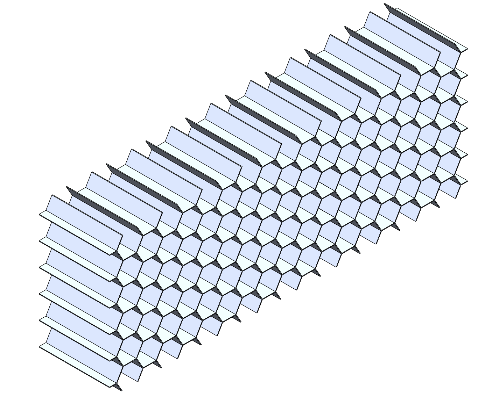
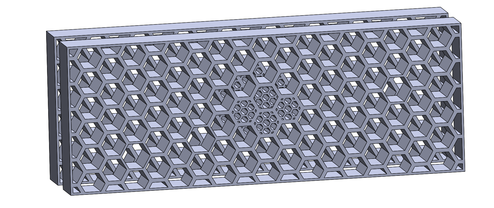
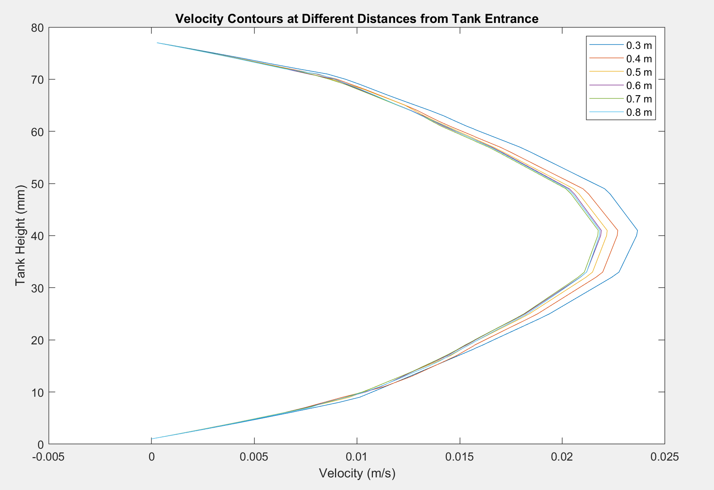
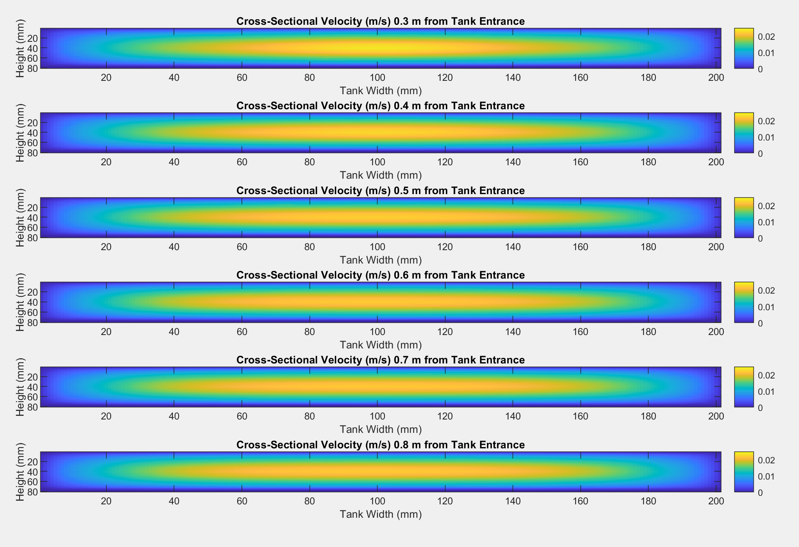
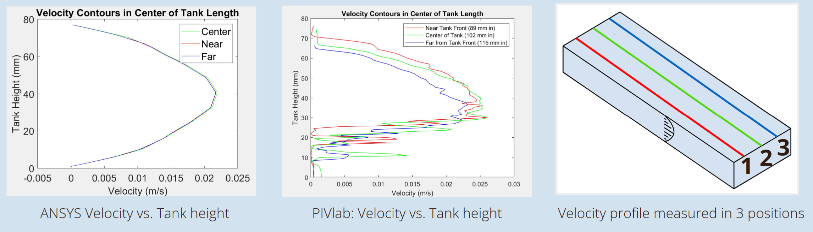

# ANSYS-Driven Flow Straightener

## Project Summary

- For senior capstone, a flow straightener was needed to disperse a jet of fluid entering a tank and ensure a near-constant parabolic fluid velocity profile in the rest of the tank.

{:refdef: style="text-align: center;"}

{: refdef}

{:style="text-align: center;"}
Final capstone prototype visualizing Navier-Stokes.

## Design Steps

- A simplified SOLIDWORKS model representing the system fluid volume was built containing one iteration of the flow straightener.
- The model was imported into ANSYS Fluent R2 and meshed with the watertight geometry workflow and solved with a laminar model and mass flow input/output boundary conditions.
- The resulting velocity data was analyzed in MATLAB and used to adjust the geometry of the flow straightener.

{:refdef: style="text-align: center;"}

{: refdef}

{:style="text-align: center;"}
Original flow straightener.

{:refdef: style="text-align: center;"}

{: refdef}

{:style="text-align: center;"}
Final flow straightener.

## Challenges

- The large size of the overall fluid volume and the small details of the honeycomb flow straightener resulted in meshes with over 1 million cells. To speed up processing times and reduce unnecessarily dense meshes, bodies of influence were used to concentrate mesh detail in critical regions.
- There was a negative correlation between a high maximum velocity and a well-dispersed, parabolic velocity profile. To maintain a reasonably fast velocity while also minimizing the jet effects, a combination of small honeycombs, multiple straighteners, and obstacles in front of the jet entrance were used.

## Results

- The final iteration of the flow straightener resulted in a fairly parabolic velocity profile along a length of around 0.5 m of the tank at a maximum velocity of around 0.87 in/s, close to the expected speed of the fluid. This ensured that the project’s goal of visualizing a parabolic velocity profile using particle image velocimetry was plausible.

{:refdef: style="text-align: center;"}

{: refdef}

{:style="text-align: center;"}
ANSYS Fluent output graphed via MATLAB describing the parabolic velocity profile at each distance from the pipe entrance.

{:refdef: style="text-align: center;"}

{: refdef}

{:style="text-align: center;"}
ANSYS Fluent output graphed via MATLAB describing the cross-sectional velocity profile at each distance from the pipe entrance.

- Once the final prototype was built, these theoretical results aligned with our experimental results using particle image velocimetry (PIV) to track the fluid velocity in the tank.

{:refdef: style="text-align: center;"}

{: refdef}

{:style="text-align: center;"}
Theoretical ANSYS and experimental PIV results are aligned.

## Skills Developed

- Generating and interpreting CFD analysis results to make design enhancements
- Synthesizing the results of previous iterations into an improvement

## Additional Info

- For more information on the final capstone project, check out the Executive Summary [here]() or the final Capstone presentation [here]().
- For more details on the ANSYS analysis I conducted, read the Engineering Appendix in the Executive Summary.