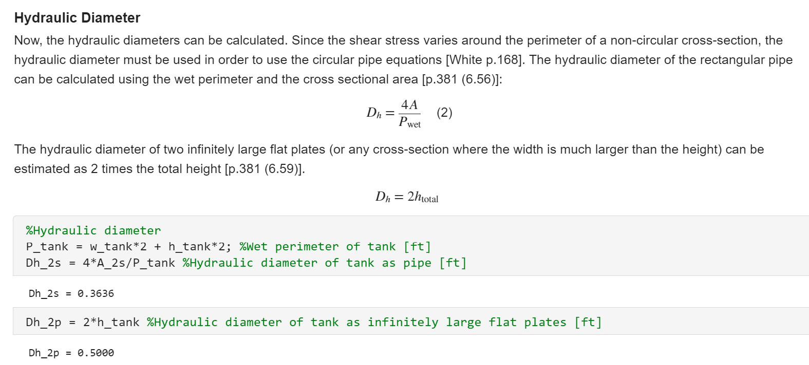
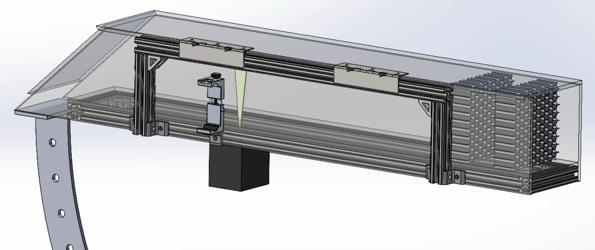

# Analysis of Poiseuille Flow In Rectangular Duct vs. Infinitely Large Flat Plates

## Project Summary

- My senior capstone design team needed to characterize the flow within our system in order to build a physical model visualizing Poiseuille flow between infinitely large flat plates.

## Analysis Steps

- The intended design was simplified into key geometric properties describing a system where a pump drives the movement of a water-glycerin mixture through pipes into a sealed rectangular pipe.
- The inputs (our design needs) were defined to ensure incompressible, Newtonian, laminar fluid flow in a reasonable size range.
- The outputs (in terms of velocity, volumetric flow rate, and pump delivery pressure) were calculated using fluid mechanics concepts.

{:refdef: style="text-align: center;"}

{: refdef}

{:style="text-align: center;"}
MATLAB live script code snippet.

## Challenges

- Since infinitely large flat plates are not possible to build and our maximum size range is something that can fit through doors, we needed to ensure that flow within a rectangular duct could approximate flow between infinite plates. Calculations were done for both scenarios and compared.
- To ensure laminar flow, the Reynold’s number was set to a low value. This made the resulting velocity very low, which required the viscosity of the mixture to be adjusted with various proportions of water and glycerin.

## Results

- MATLAB was used to document the analysis, allowing the capstone team to adjust the input parameters until a desired set of output parameters were achieved. This analysis drives all the key components of the design: the dimensions, the materials, and the pump.

{:refdef: style="text-align: center;"}

{: refdef}

{:style="text-align: center;"}
Resulting analysis-driven CAD.

## Skills Developed

- Using mechanical engineering concepts to drive and justify design decisions
- Simplifying complex systems for mathematical analysis

## Additional Info

- The MATLAB Live script can be downloaded [here](https://github.com/CA-Wu/portfolio/blob/main/extras/flow_analysis_static_ver.mlx).