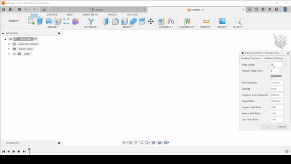

# Parametric Kresling Script

## Project Summary

- The Programmable and Reconfigurable Soft Engineered Systems (PARSES) Lab needed a script to quickly and automatically generate CAD of the Kresling origami pattern based on a set of adjustable parameters.

## Design Steps

- The Kresling pattern was built manually in Autodesk Fusion 360 to examine how key parameters shaped the resulting feature tree.
- The feature tree was translated into code with adjustable variables using Python and Autodesk Fusion 360’s Scripts feature.
- The resulting Kresling model was sliced for 3D printing in Simplify3D to locate difficult-to-print geometry.

{:refdef: style="text-align: center;"}

{: refdef}

{:style="text-align: center;"}
The script allows the parameters of the Kresling to be altered in real-time via a GUI.

## Challenges

- The Kresling origami shape is usually built with paper with very little wall thickness – preserving the geometry’s properties and translating it  into a 3D-printed form with significant wall thickness required creative CAD interpretations of the Kresling’s mathematical model.
- Some sets of parameters are unsolvable and throw errors in Fusion 360. To ensure the script generates CAD successfully every time, the limits of each parameter were investigated and built into the GUI.

## Results

- The script outputs a model of a Kresling module with fully adjustable input parameters so that any researchers of soft origami robotics can investigate and characterize different Kresling shapes.

## Skills Developed

- Assessing tradeoffs between manufacturability and desired properties
- Translating mathematical models into CAD

## Additional Info

- For more detailed information on the script and to run it yourself, check out the [PARSES Kresling repository here](https://github.com/PARSES-Lab/kresling-structure).