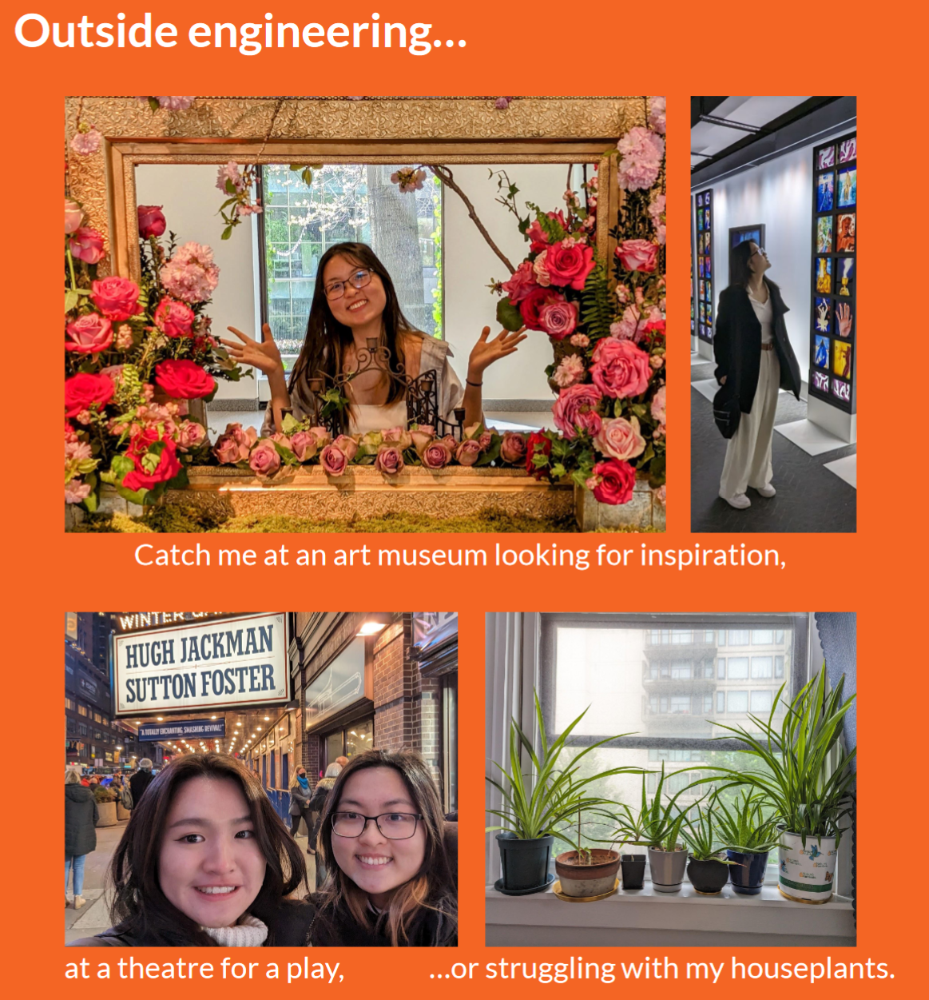

{: style="color:orange; text-align: center;"}

{: style="color:orange; text-align: center;"}

# About Me

{:style="color:orange; text-align: center;"} 

## Hi! My name is Ash.

{:refdef: style="text-align: center;"}
{: width="250"}
{: refdef}

{: style="text-align: center;"}

I’m a Mechanical Engineer (BSME) graduating from Northeastern University in May 2024.

{: style="text-align: center;"}
3D printing was my first great engineering love, a gateway I fell into while prototyping parts for the [FIRST Robotics Competition (FRC)] back in high school. As the technology that first inspired me, I was fascinated by the accessibility of additive manufacturing and by how it could be harnessed to inspire others.

{: style="text-align: center;"}
That fascination lead me first to a **3D Designer Intern** position at [Makelab], a 3D printing consultancy, then to a **Print Production Operation** internship at [Formlabs] in 2021. I then joined [Desktop Metal] as a **Mechanical Engineering Co-Op** on the Sustaining team in the Spring of 2022.

{: style="text-align: center;"}
At the same time, I worked as a **Research Assistant** at Northeastern’s [Programmable and Reconfigurable Soft Engineered Systems (PARSES) Lab], exploring the intersection between 3D printing and human interaction design. While my first great engineering love was driven by the joy of design, the second blossomed from a realization of what impact these designs could have: they could boost the safety of human-robot interactions. They could enable life-saving medical procedures.

{: style="text-align: center;"}
I discovered how fulfilling it was to facilitate these positive impacts myself as a **Urology R&D Co-Op** at [Boston Scientific] in the Spring of 2023. When I graduate in the Spring of 2024, the engineer I hope to become is one that keeps positively impacting patients’ lives and building tools that inspire.

----

[FIRST Robotics Competition (FRC)]: https://www.firstinspires.org/robotics/frc
[Makelab]: https://makelab.nyc/
[Formlabs]: https://formlabs.com/
[Desktop Metal]: https://desktopmetal.com/
[Programmable and Reconfigurable Soft Engineered Systems (PARSES) Lab]: https://parses.sites.northeastern.edu/
[Boston Scientific]: https://www.bostonscientific.com/en-US/Home.html
